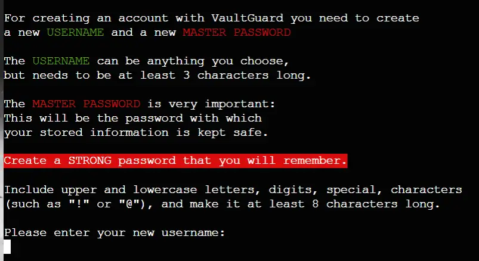
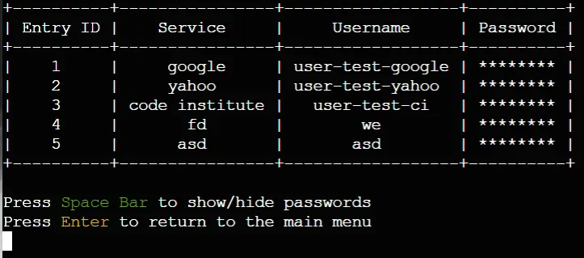

# VaultGuard

Welcome to the Readme file for VaultGuard, a web based personal password manager built with Python.

**Link to Live Site: https://vault-guard-f006577d0925.herokuapp.com/**
 
 
*For testing the application, please use the following login details:*

Username: 	**test**

Password: 	**12345**
 
 

## Table of Contents

1. [Overview](#overview)
2. [UX](#ux)
    - [User Stories](#user-stories)
        - [User](#user)
        - [Site Administrator](#site-administrator)
    - [Site Concept](#site-concept)
    - [Flowchart](#flowchart)
    - [Site Design](#site-design)
3. [Features](#features)
    - [Existing Features](#existing-features)
        - [Login Menu](#login-menu)
        - [Login Option](#login-option)
        - [Create New Account Option](#create-new-account-option)
        - [View Vault](#view-vault)
        - [Add Password](#add-password)
        - [Delete Password](#delete-password)
        - [Edit Vault Item](#edit-vault-item)
        - [Check Data Breaches](#check-data-breaches)
        - [Encryption Details](#encryption-details)
    - [Future Ideas](#future-ideas)
4. [Testing](#testing)
    - [Manual Testing](#manual-testing)
    - [Validator Testing](#validator-testing)
    - [Bugs](#bugs)
        - [Fixed](#fixed)
        - [Unfixed](#unfixed)
5. [Deployment](#deployment)
    - [Links](#links)
6. [Credits](#credits)
    - [Content](#content)
    - [Media](#media)

## Overview

VaultGuard is a web based personal password manager, that allows users to store a list of usernames and passwords to a variety of services that they use. Each new user created a personal account with a strong master password that is verified, before they can then proceed to create a ‘vault’ or list of username + password credentials that they would like to save.

Users can add, edit, remove, or view vault items. VaultGuard also provides functionality for checking whether stored passwords were leaked in any previous public data breaches.

**Please Note**:  Even though user master passwords are securely Hashed, and stored passwords are properly encrypted, credentials are not stored in a secure enough environment to satisfy the requirements for a commercially used password manager. Above all, since I am not professionally trained in cryptography is recommended that VaultGuard be used for demo purposes only, and that *users do not store actual sensitive information* in the application database.

## UX

### User Stories

The sentences below outline possible motivations of *potential users* visiting the site. Goals of myself as site administrator is also added.

#### User

> As a user, I want to be able to create an account and then store information that is only visible to those who have my master password.

> As a user, I want my stores information to be available whenever I log into the application.

> As a user, I want to be able to have passwords generator by an application that can ensure me that my passwords are strong enough for security purposes.

> As a user, I want to be able to check whether passwords I currently use are safe, or whether they have been involved in any public data breaches over the last years. Checking these each individually is too time consuming and unpleasant: I want this to be automated for me.

#### Site Administrator

> As the app administrator I would want users to be aware of the utility and effectiveness of password managers and consider making use of professional password management software.

>  As the app administrator I want to ensure that users are taught the value of online security and understand the basics of password management, and password strength. I want my application to incorporate these elements in an easy-to-understand manner.

> As the app administrator my aim is to captivate users' interest in any future (paid) features the app could possibly offer.

> In my role as the app administrator, I endeavour to develop a product that establishes my identity as a reliable site/app developer, one who prioritizes the welfare of users.

### Site Concept

A simple password manager that focuses on:

- Security

- Strong input validation

- Data hygiene

### Flowchart

The below flowchart shows the application functionality and the expected user experience when engaging with app’s different functions. The flowchart if not exhaustive, since many steps require small additional steps that are not clearly documented, as this would make the flowchart overtly complex. But it gives a good idea of the app’s layout and functions. The flowchart was created with [Lucid Chart](https://www.lucidchart.com/pages/)

### Site Design

Being a terminal project, VaultGuard has very little design due to the constraints of the terminal environment. However, the following three Python libraries brought some design elements into the mix:

-	[Console Menu](https://pypi.org/project/console-menu/) | A python library by Aegir Hall that simplifies the creation of visually appealing menu’s for app users to interact with. The library greatly simplified app navigation.

-	[Prettytable](https://pypi.org/project/prettytable/) | Since the password manager uses tables to list information, this python library by Luke Maurits fits perfectly into the design by creating visually appealing tables with which to display information.

-	[Colorama](https://pypi.org/project/colorama/) | A python library by Jonathan Hartley that introduces foreground and background colour to the terminal. This helped when wanting to draw the user’s attention to important information being printed.
 
 
*The three libraries, mentioned above, in action*

As a final touch of colour, I updated the console background with a vault image and centred the console for improved user experience.

## Features

All app features were built with **robust input validation** and **strong data hygiene**. 

### Existing Features

#### Login Menu

Users are greeted with the app’s ASCII logo, slogan, and a main menu. Here users can either select to either login or create a new account. The Console Menu Python library automatically takes care of input validation in menu’s, refusing to accept incorrect inputs.

#### Login Option

User can login by first entering their usernames. If the entered username is not found within the existing list of usernames, users are encouraged the create a new account. Else, users may enter their master passwords which are masked with asterisk characters while being typed. If the password in incorrect users may try again or return to the main menu. Stored passwords are hashed, so the application verifies the user’s identity be also hashing the entered password and checking that against the hash of the stored password.

#### Create New Account Option
Upon choosing the create account option users are first presented with information describing how account creation works. 

Usernames can be anything but must be at least three characters long (not three black spaces). If an entered username in found in the list of existing usernames, users are encouraged to use their existing accounts and log in. New users also cannot use the word ‘users’ as a username since this is reserved for internal app usage. When users create a new password, this is checked to satisfy all requirements of a strong password, and if not, details are printed out so the user knows what steps to take to satisfy the app’s input validation. Note: An exception was made for the test account where the password is simply ‘12345’. Here, password generation is not available since user’s need to enter a Master password they can (1) easily remember, (2) but is also a strong password.

If an account is created successfully, the password is hashed, stored in the database along with the new username, and a new blank database (i.e. Google Worksheet) is opened and prepared for the new user.

#### View Vault
Here user’s may view their list of currently stored credentials. Users also have the option to temporarily view their decrypted passwords using the space bar key. If the user vault is empty, this is also displayed.

#### Add Password

This function allows users to add new credentials to their vault. A new (1) service name – i.e. the name of the website, app, or other service whose credentials they are saving, (2) username and (3) password. Here usernames and passwords are not checked for validation (except that they cannot be empty or consist only of spaces. This is because user’s need to be able to enter the actual usernames, email addresses or passwords that they currently use. When entering credentials for a new service users may also choose the app’s option of having a strong password automatically generated.

#### Delete Password

This function allows users to delete a single credential from their vault. The vault is displayed, and user’s identify which item to delete by entering the ID of the credential. Any other input is not accepted. When the user has selected the item, the item is again displayed, and user confirmation is requested before the item is deleted. After deletion, the IDs of the remaining passwords are reordered from 1 upwards, to avoid future duplicate ID’s.

#### Edit Vault Item

Users can edit an existing credential in place by again indicating the item to be editing by entering its ID in digits. No other inputs are accepting. Upon editing, users may again use the app’s built in strong password generator if needed.

#### Check Data Breaches 

Check Data Breaches – This, final function of the app checks all the password’s in the user’s vault against the list of known compromise passwords on https://haveibeenpwned.com/ (HIBP). The free HIBP API allows anyone to check their passwords (or hashed versions thereof) for security, and VaultGuard makes use of this functionality.

The process is first explained to the user and confirmation requested before proceeding. If breached or leaked passwords are found the user is informed. If not, the user is congratulated and reassured that his/her accounts are not compromised.

#### Encryption Details

VaultGuard stores a list of user’s credentials in a Google Sheets Database.
Passwords are encrypted with a Secure Hash Algorithm 2 [(SHA-256)](https://en.wikipedia.org/wiki/SHA-2)  that uses random data as additional input [(salt)](https://en.wikipedia.org/wiki/Salt_(cryptography)) tied to the users Master Password. User App passwords (i.e. the passwords users use to login to VaultGuard) are similarly Hashed with a SHA-256 algorithm.

### Future Ideas

1.	**Improve security**: As mentioned in the [start](#overview) of this document, as I am not trained in cryptography, the app certainly needs an overview by a professional software developer with experience in cyber security, for suggestions o improving the safekeeping of stored information.

2.	**Front End**: With the back-end side of the password manager in place, it would be nice to also build a visually stylish front end around the theme of an actual bank vault. This would naturally make the app more accessible to a larger audience.

3.	**Notes and Images**: It would be nice to allow future user’s to also store notes and even media (images, sound clips, videos) in their vaults.

## Testing

### Manual Testing

| What will be Tested? | Expected Outcome | Data Entered | Result |
|--|--|--|--|
|Menus|Wrong Inputs aside from Menu options are not accepted in both the login and main menu| ‘q’ / ‘13’ / ‘ ‘ / ‘!’ / ‘3’ = Accepted|Pass|
|Create New Account|Usernames must be at least 3 Characters long and all empty spaces are not accepted|‘us’ / ‘!s’ / ‘   ‘ /  ‘use’ = Accepted|Pass|
|Create New Account|Usernames already in the database are not accepted for new users|'test' = Not Accepted|Pass|
|Create New Account|Passwords must be strong. At least 8 Characters long and contain (1) an Uppercase letter, (2) Lowercase letter, (3) Digit, (4) Special Character|‘Testpass9’ / ‘testPass’ / ‘testP!0s’ / ‘testPa!s9’ = Accepted|Pass|
|Login|Only valid usernames already in the database are accepted|‘test123’ / ‘Leon’ /  ‘test’ = Accepted|Pass|
|Login|Entered Passwords must match (the hashed versions) of those in database of said user|‘12345’ = Accepted|Pass|
|Other App Functions|“Show Saved Passwords” displays current vault. Space Bar allows users to see decrypted passwords.|Menu Option / Space Bar|Pass|
|Other App Functions|“Add a new Password” and “Edit Vault Item” does not accept empty service names, usernames, and passwords, but everything else is accepted.|‘ ‘ /  ‘      ‘ /  ‘\n’ /  ‘1’ = Accepted|Pass|
|Other App Functions|“Delete Vault Item” asks for user confirmation before deleting an item from the database.|Chose Item to Delete and gave confirmation with ‘y’|Pass|
|Other App Functions|All vault functions, except for “Add a New Password” checks if the user vault is empty before proceeding.|Chose these items with an empty vault.|Pass|
|Other App Functions|“Check for exposed Passwords” requires user confirmation before proceeding with HIBP API.|Gave confirmation with ‘y’|Pass|

### Validator Testing

The PEP8 Python formatting [validator](https://pep8ci.herokuapp.com/) initially showed many errors (some detailed below) when it first scanned my Python code. I took time to correct every little detail, including reformatting lines that were too long, and the current version of the app shows no errors when the Python code is run through the validator.

### Bugs

#### Fixed
-	The bug that took the longest time to fix had to do with password encryption. I discovered that when tying encryption to a master password, the Fernet function (which is part of the Python cryptography library) still used salt (see [Encryption Details](#encryption-details) above) which meant that a Fernet Key needed to be stored locally somewhere within the database to enable to users to decrypt passwords once they log out of the app, and back in. I couldn’t do this as the Gspread library used JSON to write to Google Sheets and JSON could now store salt (in bytes) to Google Sheet. I overcame this (after much research) by tying the salt generation also to the user Master Password. I’m sure there are better ways to do this, involving Key Management Systems, but these were beyond the scope of this project. As it stands users are able to encrypt and decrypt passwords only when their Master Passwords are initially entered correctly.

-	Users were able to enter three black spaces as a new username which was excepted. Since the input validation only checked for an input length >= 3, three black spaces were able to pass. I then added an extra validation which uses a regular expression to only allow new usernames that also contains a character.

-	The PEP8 validator initially showed a multitude of issues, mostly having to do with visual formatting. These were all fixed by removing trailing or missing white space, shortening lines to a maximum of 79 characters and adding a final blank line to the end of the file.

-	In the single instance where I used a `try … except` block, the PEP8 validator did not like the use of a bare `except:` statement. I updated this to `except ValueError:`

-	For validating new login password strength, I struggled to have the computer also check for a variety of special characters. With the regular expression statement, since so many of the special characters required escaping with the `\` key, this proved challenging. I finally managed with some help (see credit below).

-	When a new user created an account and a new user database (i.e. Google Worksheet) was created, this was initially not picked up by the program which led to errors when the user tried to access their newly created vault. This bug was fixed by first closing and then reopening the Google Sheet within Python, which forced the program to re-read the data within the entire sheet.

-	When a new user tried to add a first item to his/her vault, the code threw an error since no previous item ID numbers were available to use as reference. I overcome this bug by using a `try … except` block which allowed the program to create a new ID of `1` in case no other IDs were available.

-	When a user wanted to edit an existing credential within their vault, I initially had some trouble updating individual cells within the database, as opposed to replacing entire rows or columns. The official gspread library documentation helped me fix this bug.

-	Initially users were able to check their stored passwords for breaches even when their vault was empty, which of course let to an error. This was fixed by first checking whether vaults had items in them before proceeding, as was already the case with the delete and edit functions.

#### Unfixed

There are no unfixed bugs that I’m aware of.

## Deployment

These are the steps I followed to deploy the project to Heroku:

1.  I created an Heroku account and logged in.

2.	I clicked New and created a new app on the dashboard.

3.	I entered a unique name, selected the region (in my case, Europe), and clicked Create app.

4.	Within the created app, I selected the tab, Settings.

5.	At the Config Vars section, I clicked Reveal Config Vars.

6.	To use Google Sheets, I added a new config var with the key CREDS. For the value, I pasted the contents of the creds.json file that was previously created when setting up the Google Sheets API.

7.	I added another config var with the key PORT and set the value to 8000.

8.	Below the Config Vars section, I clicked Add buildpack. I selected Python and saved. Then I added another buildpack and selected node.js. It was important that the buildpacks were shown in this order.

9.	Back in the Integrated Development Environment, I created a list of requirements by typing pip3 freeze > requirements.txt into the terminal. (Note: In my specific case, the cryptography library was NOT added to the requirements.txt file when using freeze, so I manually entered cryptography into the requirements.txt file).

10.	I now ensured that a working version of my code was committed and pushed to GitHub

11.	Now on Heroku again, I navigated to the Deploy tab.

12.	I selected GitHub as the deployment method and connected to GitHub.

13.	I searched for the repository name of the project and clicked connect.

14.	Optionally, I enabled automatic deploys to deploy each time new code was pushed to the repository.

15.	I then finally clicked Deploy Branch to deploy the project.

### Links

Deployed Website: https://vault-guard-f006577d0925.herokuapp.com/ 
GitHub Repository: https://github.com/leonp84/code-institute-project-3/

## Credits

### Content

-	The Python [getch](https://pypi.org/project/getch/) library and documentation proved very helpful for capturing keypresses within the python terminal.

-	Menu generation, color and tables were done with [Console Menu](https://pypi.org/project/console-menu/), [Colorama](https://pypi.org/project/colorama/) and [Prettytables](https://pypi.org/project/prettytable/).

-	All other Python libraries used were credited and explained within the opening lines of the application codebase.

-	For help with gspread, especially with updating individual cells the official [gspread documentation](https://docs.gspread.org/en/latest/) was great.

-	For help with basic cryptographic concepts, involving hashing and encrypting, the following resources were very helpful: 
    - [Password hashing and encryption](https://dev.to/dpills/python-secure-password-management-hashing-and-encryption--1246)
    - [Python Cryptographic Library](https://stackoverflow.com/questions/71667730/encrypting-message-with-user-input-as-key-python-fernet)
    - [Help with Python Fernet Key and Salt](https://github.com/pyca/cryptography/issues/1333)

-	For the (very tricky) regex statement to capture all special characters in a newly generated password I asked [ChatGPT](https://chat.openai.com/) to help after inputting the exact special characters I needed to be checked.

-	Inspiration for the Typewriter function from my fellow Code Institute classmate [Priyanka Dhanabal](https://github.com/Priyanka-Dhanabal/cut-2-chase-pp3/blob/main/run.py#L11)

-	Other general inspiration from previous Code Institute projects [Precious Password by Daniel Stauffer](https://github.com/RebellionWebdesign/precious-password/) and [Lockminder by Danilo Martins](https://github.com/Danvm94/lockminder)

-	For help with getting a favicon to work with Heroku deployment I looked at the work of the very talented [Julia Wagner](https://github.com/Julia-Wagner/PyChef).

### Media

-	ASCII Banner Logo generated with https://patorjk.com/software/taag

-	Favicon image from [Pixabay](https://cdn.pixabay.com/photo/2020/04/07/15/07/vault-5013752_1280.png).

-	Background image by [Jason Dent](https://unsplash.com/@jdent) on Unsplash.
